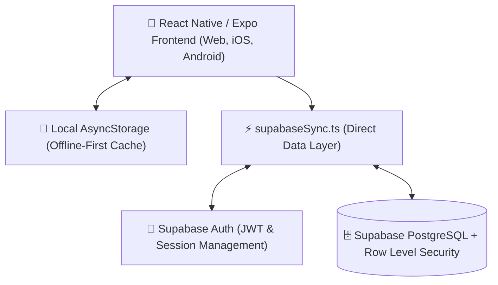

# ⚔️ Solo Leveling Quest App — System Documentation

> **"You have received a quest from the System. Will you accept?"**

---

## 1. 🌌 Concept & Overview

**Solo Leveling Quest** is a gamified daily self-improvement and habit-tracking progressive web/mobile application inspired by the **Solo Leveling** anime/webtoon series. 

The app turns real-life personal development into an RPG progression system. Users awaken as an **E-Rank Hunter**, receive daily quests across fitness, deep work, and discipline, battle weekly dungeon raids, level up stats (**STR**, **INT**, **STAMINA**, **DISCIPLINE**), and climb hunter ranks from **E-Rank** up to **S-Rank Monarch**.

---

## 2. ⚡ Core Features & Mechanics

### 🔮 1. Awakening Sequence (First-Time Onboarding)
- **Interactive Holographic Terminal**: Terminal-style awakening typewriter dialogue simulating the System choosing the user as a Player.
- **Pulsing Awakening Orb**: Visual effect responding to user interaction.
- **Hunter Name Registration**: User registers their Hunter Name, which is synced to their cloud Hunter License.
- **Stat Distribution & Initial Evaluation**: Grants initial base attributes (STR: 1, INT: 1, STAMINA: 1, DISCIPLINE: 1) and awards the **E-Rank Badge**.
- **Replayability**: Users can replay their Awakening sequence at any time from the Profile tab.

---

### 📋 2. Daily Quest Log & Progressive Overload
- **Daily Quests Grid**: Dynamic quest cards categorized into **TRAINING**, **MIND**, **DISCIPLINE**, and **RECOVERY**.
- **Starter Quests**:
  1. **100 Push-ups** (*STR*): Uses progressive overload ramping.
  2. **20 Sit-ups** (*STAMINA*): Uses progressive overload ramping.
  3. **Gym Regimen** (*STAMINA*): 45-minute minimum workout (Mon/Wed/Fri).
  4. **Deep Work Coding** (*INT*): 60-minute distraction-free focus block.
  5. **Chew Gum / Posture** (*DISCIPLINE*): 20 minutes of facial/posture discipline.
- **Progressive Overload Ramping Engine**: Starter quests automatically increase in intensity every 3 days (`20 → 40 → 60 → 80 → 100 reps`) as the hunter adapts.
- **Custom Quest Creation**: Hunters can create custom quests with custom targets, units, XP rewards, assigned stats, and active days of the week.
- **Rest Days Configuration**: Selectable rest days where quests are excused without penalty or breaking streaks.

---

### 📊 3. Hunter Profile & RPG Progression Engine
- **Hunter License Card**: Futuristic holographic card displaying Hunter Name, Level, Rank badge, and Title.
- **XP & Leveling System**:
  $$\text{XP Required for Level } L = 1000 + \max(0, L - 1) \times 100$$
- **Rank Tiers**:
  | Rank | Level Required | Title / Tier |
  |:---:|:---:|:---|
  | **E** | Level 1–7 | Novice Hunter |
  | **D** | Level 8–14 | Awakened Trainee |
  | **C** | Level 15–24 | Certified Dungeon Raider |
  | **B** | Level 25–34 | Elite Vanguard |
  | **A** | Level 35–49 | Guild Master Candidate |
  | **S** | Level 50+ | Shadow Monarch |
- **Core RPG Attributes**:
  - **STR (Strength)**: Built through pushups and resistance training.
  - **INT (Intelligence)**: Built through deep work and coding.
  - **STAMINA (Stamina)**: Built through core workouts and gym sessions.
  - **DISCIPLINE (Discipline)**: Built through consistency and daily completion.
- **Streak Tracker**: Tracks consecutive days of completing all required daily quests.

---

### 🏰 4. The Architect's Trial (Weekly Dungeon Raids)
- **Automatic Weekly Dungeon Generation**: Runs on a weekly Sunday-to-Sunday cycle.
- **Raid Objective**: Complete each active quest at least twice during the week.
- **Evaluation Mechanism**: At the end of the weekly cycle, evaluates if the raid **PASSED** or **FAILED**.
- **Claimable Loot & Rewards**:
  - `+300 XP`
  - `+3 DISCIPLINE` permanent stat boost
  - Exclusive Hunter Title: **"Breaker of the Architect"**

---

### ⚠️ 5. The System Penalty & Lockdown
- **Penalty Quest Zone**: Simulates the penalty dungeon from the series.
- **24-Hour Social Lockdown**: If a hunter neglects their daily quests or manually triggers penalty mode:
  - Streak is reset to `0`.
  - Deducts `100 XP`.
  - Imposes a 24-hour countdown lockdown with glowing crimson system warnings.

---

### 📅 6. History & Quest Log Archive
- **Activity Calendar**: Monthly calendar visualization displaying completed days with glowing blue gate markers.
- **Historical Log**: Inspect specific past dates to review what quests were completed.

---

### 🔔 7. Notifications & Tactical Alerts
- **System Gate Open (07:30)**: Morning notification opening the daily training gate.
- **Mid-Day Warning (21:00)**: Reminder before the midnight evaluation.
- **Streak at Risk (22:00)**: High-priority warning if daily quests remain unfinished.
- **Weekly Raid Announcement (Monday 08:00)**: Weekly dungeon gate opening alert.

---

## 3. 🏗️ Technical Architecture

### Tech Stack
- **Framework**: Expo SDK 57 (React Native 0.86, React 19, Expo Router 57)
- **Styling & UI**: Custom Solo Leveling dark cyberpunk theme with holographic blues (`#00E5FF`, `#0066FF`), deep obsidian backgrounds (`#070B13`), and neon crimson warning highlights (`#FF2A55`).
- **Animations**: `react-native-reanimated` (smooth 60fps spring transitions, typing animations, particle glow).
- **Icons**: Expo Vector Icons (`MaterialCommunityIcons`, `Ionicons`, `Feather`).
- **Database & Auth**: Supabase PostgreSQL with Row Level Security (RLS) + Supabase JS Client.
- **Hosting**: Netlify static single-page app (SPA) with automatic redirects.

---

## 4. 🗄️ Database Schema (Supabase)

| Table | Purpose | Key Columns |
|---|---|---|
| `profiles` | Hunter state & stats | `user_id`, `name`, `level`, `xp`, `rank`, `streak`, `stat_str`, `stat_int`, `stat_stamina`, `stat_discipline`, `title`, `lockdown_until` |
| `quests` | Active & custom quests | `id`, `user_id`, `title`, `category`, `target`, `unit`, `xp`, `stat`, `weekdays`, `is_custom`, `ramp_key` |
| `daily_completions` | Quest completions by date | `user_id`, `quest_id`, `completed_date` |
| `rest_days` | User rest day schedule | `user_id`, `day` (0 = Sun, 6 = Sat) |
| `raids` | Weekly dungeon progress | `id`, `user_id`, `week_key`, `required_quest_ids`, `target`, `status`, `is_current` |

---

## 5. 🚀 Deployment Configuration (Netlify)

- **Root Config**: `netlify.toml`
- **Build Command**: `cd artifacts/solo-leveling-quest 2>/dev/null || true; npx expo export -p web`
- **Publish Directory**: `artifacts/solo-leveling-quest/dist`
- **SPA Routing**: `/*` redirected to `/index.html` with status 200.
